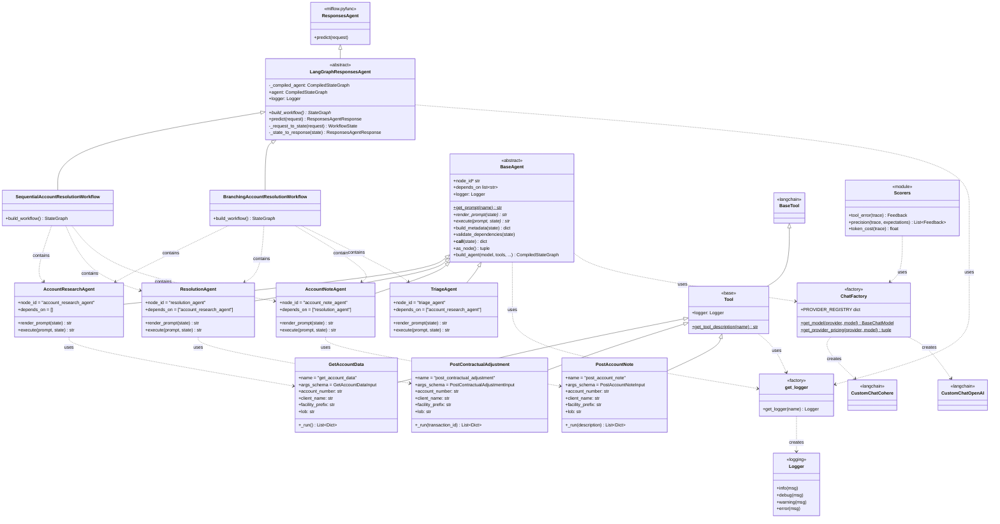

# Ensemble Phase 2 POC



## Setting up MLFlow server

1. Ensure you have uv installed and have used it to setup the env for this repo:
```
cd path\to\root
uv sync
```

2. Run the following command:
```
uvx mlflow server -p 5001
```
This will setup the mlflow server on https://localhost:5001. We recommend running the mlflow server
in one terminal instance (i.e. use tmux) while triggering workflows in another.

This will by default setup a backend store URI at `sqlite:///mlflow.db`

## Running a test workflow

1. Ensure you have an API key defined for the model you intend to use in a `.env` file in the root:
```
cd path\to\root
touch .env
```
For example, this project defaults to the Cohere chat API, which requires a `COHERE_API_KEY` to be set as an env var.

2. Navigate to the project root and use the CLI. The CLI has two subcommands: `run` and `evaluate`.

### Running a single workflow (`run`)

Execute a single workflow with MLflow logging:

```bash
# Run with defaults (branching workflow)
ensemble-phase-2-poc run

# Run sequential workflow
ensemble-phase-2-poc run -w sequential

# Full customization
ensemble-phase-2-poc run \
  --workflow sequential \
  --experiment my-experiment \
  --tracking-uri http://mlflow.example.com:5000 \
  --run-name my-test-run

# View help
ensemble-phase-2-poc run --help
```


### Running evaluation with scorers (`evaluate`)

Run evaluation on a dataset with scorers (`tool_error`, `token_cost`, `precision`):

```bash
# Evaluate with defaults (branching workflow)
ensemble-phase-2-poc evaluate

# Evaluate with sequential workflow
ensemble-phase-2-poc evaluate -w sequential

# Full customization
ensemble-phase-2-poc evaluate \
  --workflow branching \
  --experiment my-eval-experiment \
  --tracking-uri http://mlflow.example.com:5000

# View help
ensemble-phase-2-poc evaluate --help
```

### Common options

| Option | Short | Description | Default |
|--------|-------|-------------|---------|
| `--workflow` | `-w` | Workflow type (`sequential` or `branching`) | `branching` |
| `--experiment` | `-e` | MLflow experiment name | `test-workflow` |
| `--tracking-uri` | `-t` | MLflow tracking server URI | `http://localhost:5000` |
| `--run-name` | `-r` | Name for the MLflow run (only for `run`) | Auto-generated with timestamp |

## Running unit tests
**Basic Usage**
```bash
# Run all tests
uv run pytest

# Run specific test file
uv run pytest test/test_scorers.py

# Run with verbose output
uv run pytest -v
```

**Generating coverage report**
`pytest --src test/` outputs a coverage report of all files in src to your terminal

`pytest --src test/ --cov-report html` generates an html coverage report that you can open in your browser. We recommend [Live Server](https://marketplace.visualstudio.com/items?itemName=ritwickdey.LiveServer) to quickly launch a tab in your browser for viewing the report.

## Contributing
1. Install all dependencies with `uv sync`
2. Make your changes
3. Use `ruff` to lint

```
ruff check              # run lint checks
ruff check --fix        # run lint checks and auto fix
```