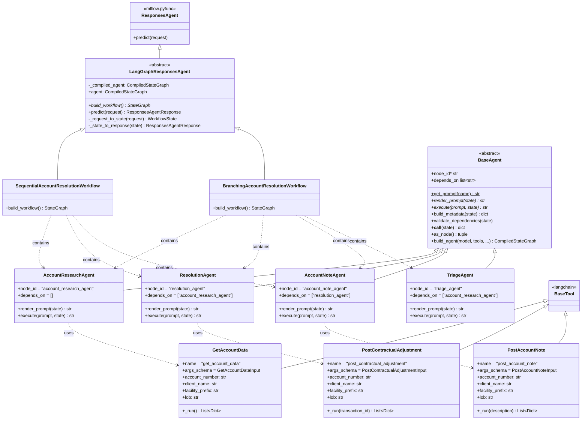

# Ensemble Phase 2 POC



## Setting up MLFlow server

1. Ensure you have uv installed and have used it to setup the env for this repo:
```
cd path\to\root
uv sync
```

2. Run the following command:
```
uvx mlflow server
```
This will setup the mlflow server on https://localhost:5000. We recommend running the mlflow server
in one terminal instance (i.e. use tmux) while triggering workflows in another.

## Running a test workflow

1. Ensure you have an API key defined for the model you intend to use in a `.env` file in the root:
```
cd path\to\root
touch .env
```
For example, this project defaults to the Cohere chat API, which requires a `COHERE_API_KEY` to be set as an env var.

2. Navigate to the project root and run the CLI. You can use it in the following ways:
```
cd path\to\root

# Use defaults (branching workflow)
ensemble-phase-2-poc

# Run sequential workflow
ensemble-phase-2-poc -w sequential

# Full customization
ensemble-phase-2-poc --workflow sequential --experiment my-experiment --tracking-uri http://mlflow.example.com:5000 --run-name my-test-run

# View help
ensemble-phase-2-poc --help
```

## Running unit tests
```
uv run test/test_import.py
```

## Contributing
1. Install all dependencies with `uv sync`
2. Make your changes
3. Use `ruff` to lint

```
ruff check              # run lint checks
ruff check --fix        # run lint checks and auto fix
```